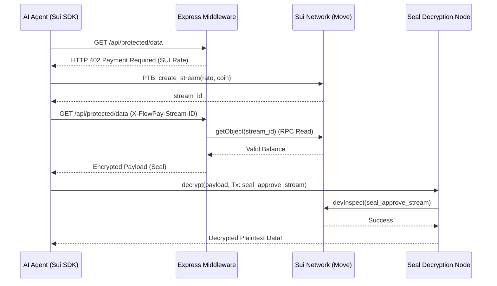

# Synapse: The Autonomous, On-Chain Knowledge Economy

Synapse (formerly SuiDataGate) is a decentralized protocol built natively on Sui that transforms AI scraping blockades into a programmatic, high-speed monetization engine. 

Designed for the **DeFi & Payments** track, Synapse enables AI agents to autonomously negotiate and stream micro-payments for access to high-value proprietary datasets and RAG (Retrieval-Augmented Generation) knowledge bases.

## The Problem
If you store a high-value AI training dataset or a corporate knowledge base in plaintext on a public network, you give away your core asset. If you keep it on a centralized AWS cluster or a siloed vector database, you lose Web3 composability and decentralized trust.

Current anti-scraping blockades (like `robots.txt` or Cloudflare bot protection) completely shut out AI agents, halting the knowledge economy.

## The Solution
Synapse combines Sui's unique Move primitives to create an automated HTTP 402 (Payment Required) gateway for AI agents.

### 1. The StreamObject (Sui Native Payments via Circle USDC)
Instead of executing a transaction for every API call (which bottlenecks throughput), Synapse uses a **Shared StreamObject**. 
- The AI agent funds a stream via a Programmable Transaction Block (PTB) using **Official Circle Testnet USDC** (`0xa1ec7fc00a6f40db9693ad1415d0c193ad3906494428cf252621037bd7117e29::usdc::USDC`).
- This allows data providers to price their bandwidth in dollars (e.g., fractions of a cent per second), aligning with traditional Web2 SaaS mental models.
- The `sui::clock::Clock` module handles rate-limiting and calculates the exact amount of claimable USDC for the data provider per second.
- The merchant can withdraw their earnings instantly using RPC reads to avoid shared-object contention, enabling ultra-low latency API responses.

### 2. Cryptographic Gating (Seal Network)
Proprietary data is encrypted using the **Sui Seal Network**. 
- The data is only decrypted if the AI agent holds an active `StreamObject` with a positive USDC balance.
- We use a custom Move policy `seal_approve_stream` that the Seal network evaluates via `devInspectTransactionBlock`.
- If the agent runs out of funds, the decryption automatically fails—no centralized server logic needed.

### 3. Gemini Payment Brain (AI Heuristics)
The AI agent is equipped with a Gemini-powered "Brain" that autonomously decides between:
- **Fast-Path Direct Payments:** For one-off, low-volume queries.
- **Shared Object Streams:** For high-volume scraping and continuous RAG embeddings.

## Architecture



## How to Run

### 1. Start the Gateway Server
The server runs the marketplace registry and the 402-gated premium endpoints.
```bash
cd server
npm install
npx tsx src/index.ts
```

### 2. Run the Full E2E Test (CLI)
In a new terminal, run the E2E test to see the SDK autonomously navigate the paywall, create a stream, scrape data, and close the stream.
```bash
cd sdk
npm install
npx tsx src/test-e2e.ts
```

### 3. Run the Dashboard UI
The React app provides a visual marketplace for providers to list APIs and for agents to discover and connect to them.
```bash
cd client
npm install
npm run dev
```

## Deployments
- **Sui Testnet Package ID:** `0xb05b3964df8b88a86cda6b192893399966014af9dd6fc6beb26f1343a0495495`

## Built With
- **Sui TS SDK 2.x** (`@mysten/sui`)
- **Sui Move** (Shared Objects, `sui::clock`)
- **Seal SDK** (`@mysten/seal`)
- **Node.js / Express** (Middleware)
- **React / Vite** (Dashboard UI)
- **Google Gemini API** (Payment Heuristics)